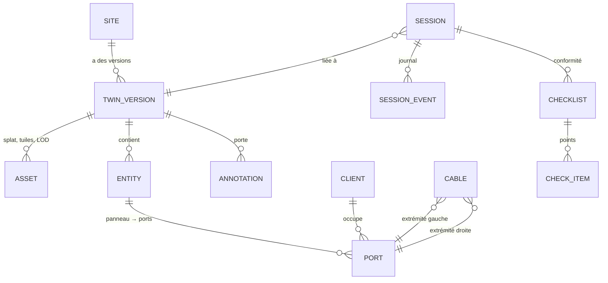

# Modèle de données du jumeau numérique

Le splat 3DGS sert à la **visualisation** ; la logique métier vit dans un **graphe structuré**.
Implémentation : `apps/twin-service` (PostgreSQL) ; contrat : `apps/api/openapi.yaml`.

## 1. Entités

| Entité | Champs clés | Notes |
|---|---|---|
| `Site` | id, nom, type (NRO/PM/PB), adresse, marqueur (id, taille physique mm) | Le marqueur définit l'origine et l'échelle du repère |
| `TwinVersion` | id, site_id, créé_le, statut (processing/ready/failed), transform_marker (4×4), score_qualité, couverture | **Immuable** ; un scan = une version |
| `Asset` | id, version_id, type (raw/splat/tile), lod, uri S3, taille, checksum | URLs signées courtes servies par l'API |
| `Entity` | id, version_id, type (panel_left/panel_right/central_zone/port/custom), nom, géométrie (box/point, coordonnées **repère jumeau**), métadonnées JSON | Les annotations sémantiques sont séparées du splat |
| `Port` | id, entity_id (panneau), index, label, client_id?, statut (free/used/faulty) | Lien panneau ↔ client |
| `Client` | id, référence, nom | « position du client X » = ses ports gauche + droit |
| `Cable` | id, port_gauche_id, port_droit_id, chemin (polyline repère jumeau)?, statut | Le chemin libre en zone centrale est tracé par l'expert |
| `Annotation` | id, version_id, session_id?, auteur, type (highlight/draw/text/gesture), géométrie, créé_le, ttl? | Toujours en **coordonnées du repère jumeau**, jamais écran |
| `Session` | id, site_id, version_id, statut, participants [{user, rôle T/E/A, device}], jetons émis | Créée par `session-service` |
| `SessionEvent` | id, session_id, ts, type, payload | Journal (audit, rapport) |
| `Checklist`/`CheckItem` | scénario (global/client/câblage), point, statut, photo_uri | Scénarios métier §3 doc 1 |

## 2. Repères et transformations

- **Repère jumeau** : origine = coin du marqueur, X le long du bord horizontal, Z vertical,
  échelle métrique donnée par la taille physique du marqueur (ex. 150 mm).
- `TwinVersion.transform_marker` : transformation splat → repère jumeau, calculée au scan.
- Côté AR : ARKit fournit monde_ARKit → marqueur à la relocalisation ; l'app compose pour
  obtenir monde_ARKit → repère jumeau. Re-relocalisation régulière (dérive) + indicateur de
  confiance ; bouton « recaler ».
- Tout échange temps réel (poses, tracés, surlignages) est exprimé dans le repère jumeau.

## 3. Scénarios métier → requêtes

| Scénario | Appels API |
|---|---|
| Conformité globale | `GET /twin-versions/{id}/entities?type=central_zone` + checklist `POST /sessions/{id}/checklists` (zone centrale, déchets, câbles débranchés) ; capture photo par point |
| Conformité client | `GET /clients/{id}/ports` → le système surligne automatiquement les 2 positions (panneau gauche + droit) via une `Annotation(type=highlight, target=port)` diffusée par Netcode |
| Câblage | `POST /cables` (port gauche + port droit) → surlignage auto des 2 ports ; l'expert trace le cheminement central (`Annotation(type=draw, polyline)`) ; `PATCH /cables/{id}` enregistre le chemin validé |

## 4. Versionnement et import

- Chaque scan crée une `TwinVersion` ; `GET /sites/{id}/diff?from=v1&to=v2` liste les entités
  ajoutées/supprimées/déplacées (comparaison géométrique simple en V1).
- Référentiel existant : `POST /import` accepte un inventaire CSV/JSON (clients, ports, câbles)
  et le réconcilie avec les entités marquées ; sinon tout est créé par marquage dans le jumeau.
- Un scan **ne met jamais à jour le SI tout seul** : les écarts sont proposés puis validés
  (`POST /twin-versions/{id}/review`).
