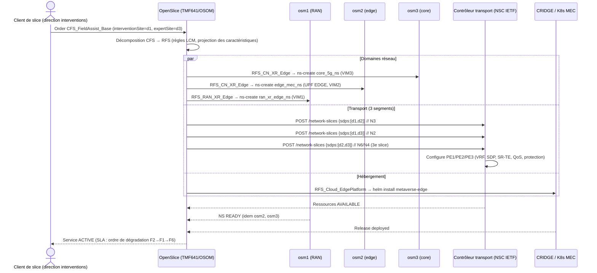
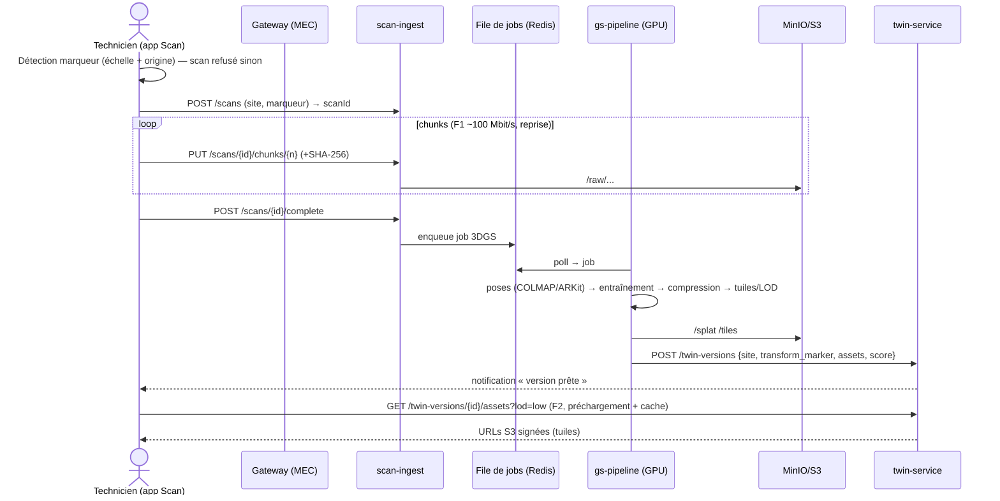
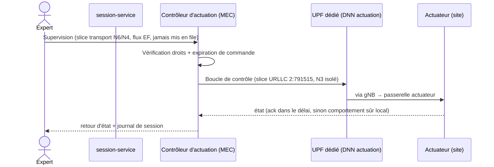
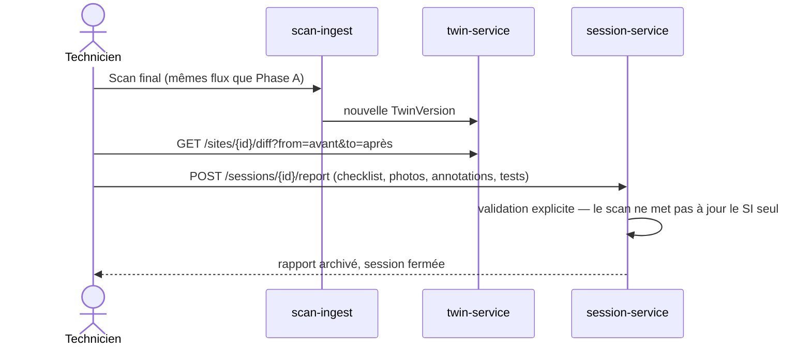

# Diagrammes de séquence

## 1. Commande du service (marketplace → réseau)



## 2. Phase A — Scan et jumeau (F1, F2)



## 3. Phases B/C — Session collaborative (F3, F5, F6)

```mermaid
sequenceDiagram
    actor T as Technicien (iPad AR)
    actor E as Expert (VR Quest)
    participant SS as session-service
    participant SIG as signaling (WS)
    participant TURN as coturn
    participant TW as twin-service

    T->>T: Phase B : guidage local (procédure AR, aucune exigence réseau)
    T->>SS: POST /sessions (site, version) — difficulté rencontrée
    E->>SS: POST /sessions/{id}/join (rôle expert)
    SS-->>T: jeton + identifiants TURN éphémères (+ Relay en option)
    SS-->>E: idem
    E->>TW: GET assets (splat) — préchargé si possible
    par Netcode (UDP, P2P sinon Relay) — F3 priorité 1
        T-->>E: pose iPad (25 Hz, non fiable, dernier état gagnant)
        E-->>T: tête+mains, tracés/surlignages (repère jumeau), commandes fiables
    and WebRTC — F6 priorité 3
        T->>SIG: offer SDP
        E->>SIG: answer SDP
        T-->>E: vidéo H.264 720p30 adaptative (TURN TCP/443 si UDP bloqué)
    end
    E->>TW: GET /clients/{x}/ports → désignation entité
    E-->>T: highlight port gauche + droit (Netcode fiable)
    Note over T,E: Si réseau dégradé : vidéo→image fixe, avatars→pointeur ;<br/>reprise automatique < 5 s ; la coupure cloud ne coupe pas le P2P
```

## 4. Option actuation (F5 + boucle URLLC)



## 5. Phase D — Clôture


